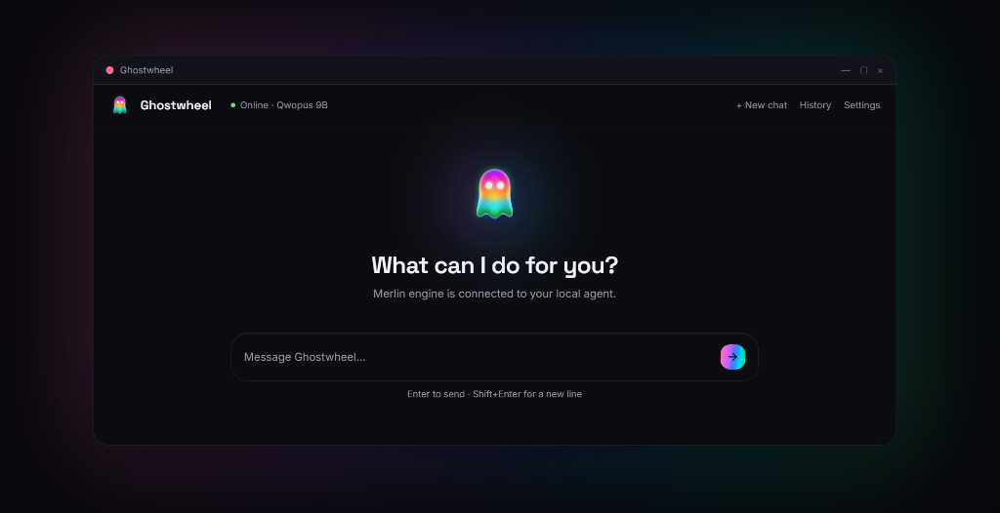

<p align="center"><strong>Ghostwheel</strong> is a coding agent that runs locally on your Windows computer with unlimited usage.</p><p align="center">  </p><p align="center">  <strong>Raw AI agent power, running locally on your hardware.</strong></p><p align="center">  <a href="#download"></a>  <a href="LICENSE.md"></a>  </p>---Ghostwheel is a Windows desktop application that integrates a local developer agent with on-device LLM inference. Built on the **Merlin Framework**, it packages a thin Tauri runtime controlling a pinned native `llama-server` sidecar. By running prompt context, file edits, and terminal executions entirely inside your local hardware boundary, Ghostwheel eliminates API token billing, network lag, and prompt telemetry.*Note: This repository is the public release tracker, documentation home, and community hub for Ghostwheel. The core runtime engine is proprietary and closed-source.*---## System RequirementsTo run Ghostwheel's local inference engine (`llama-server`) with active hardware acceleration, your machine must meet the following specifications:| Hardware Component | **Minimum Requirement** | **Recommended Specification** || :--- | :--- | :--- || **Processor (CPU)** | Intel Core i5 / AMD Ryzen 5 | Intel Core i7 / AMD Ryzen 7 (or newer) || **System Memory (RAM)** | 16 GB DDR3 or faster | 32 GB DDR4 / DDR5 || **Dedicated Graphics (GPU)** | 4 GB VRAM (NVIDIA CUDA or Vulkan) | 8 GB+ Dedicated VRAM (NVIDIA RTX) || **Storage Space** | 8 GB free space (SSD recommended) | 16 GB free space (NVMe SSD) |---## Why Ghostwheel?Cloud-based developer agents are powerful, but they expose your proprietary code to third-party servers, require complex API token subscriptions, and fail completely when offline. Ghostwheel provides a local-first alternative without sacrificing capability.### Comparison Matrix| Feature | **Ghostwheel (Local)** | **Cloud Agents (SaaS)** | **Raw CLI Wrappers** || :--- | :--- | :--- | :--- || **Data Privacy** | ≡ƒöÆ **100% Local** (No telemetry) | ΓÜá∩╕Å Cloud uploads / telemetry | ≡ƒöÆ Local || **Inference Cost** | ≡ƒÆ░ **Free / Unlimited** (Your hardware) | ≡ƒÆ╕ Per-token billing | ≡ƒÆ╕ API subscription keys || **Offline Capability** | Γ£ê∩╕Å **Yes** (14-day grace token) | Γ¥î Requires internet | Γ¥î Requires internet || **Hardware Acceleration** | ΓÜí **CUDA & Vulkan** auto-selection | Γ¥î Runs in cloud VM | ΓÜá∩╕Å Manual setup required || **Sandboxed Tooling** | ≡ƒ¢í∩╕Å **SSRF & Command Confirmations** | ΓÜá∩╕Å Full container access | Γ¥î Runs naked on host |---## Boot Diagnostics LogOn startup, Ghostwheel executes a full diagnostic checks sequence to verify dependencies and hardware allocation:```bash$ ghostwheel boot[ok]   webview2 runtime: 121.0.x[ok]   llama-server: b9729 (cuda-13.3-x64)[ok]   model: Merlin-9B-Coder-Q5_K_M.gguf       sha256: 7e3cΓǪverified[ok]   sqlite: %LOCALAPPDATA%\ProjectMerlin\merlin.db[ok]   license: active ┬╖ grace 14d[ok]   network egress: 0 bytes$ ready_```---## Installation & Getting StartedGhostwheel is distributed as a signed MSI installer for Windows 10 and 11.1. **Download**: Fetch the installer matching your hardware profile from our website's **Download Center** (routed at `#releases`).2. **Verify Checksum**: Always verify the installer's integrity by comparing the SHA-256 hash in PowerShell:   ```powershell   Get-FileHash .\Ghostwheel-Installer-CUDA.msi -Algorithm SHA256   ```3. **Run**: Run the installer and input your waitlist license key on first boot.For advanced configuration (VRAM allocation, context scaling, custom model manifests), visit our website's **Docs** section (routed at `#docs`).---## Project Status: Pre-AlphaGhostwheel is currently in a private pre-alpha phase, with active builds compiling on our local loop.* To lock in your spot and receive early-access release keys, join the waitlist at our website's **Waitlist Form** (routed at `#download`).* If you want to speed up the compiler and back Rydell's development, you can **Buy Rydell a Coffee** via the link on our homepage or backer page (routed at `#backer`).---## Why Closed Source?While Ghostwheel is built on top of open-source libraries (such as `llama.cpp` and `Tauri`), the core orchestration layers, safety guards, and commercial integrations are proprietary.This model allows us to:1. Guarantee rigorous verification bounds on local command-execution safety before wide release.2. Fund full-time development and active compiler maintenance.3. Ensure absolute compliance with licensing and distribution policies.We are fully committed to open-source compliance; all third-party notices and licenses are documented on the website's **Third-Party Notices** page (routed at `#licenses`).---## Community & Feedback* **Bug Reports & Feature Requests**: Please use our [Issue Tracker](https://github.com/GhostwheeI/project-merlin/issues) to report bugs or suggest enhancements.* **Security Disclosures**: Found a vulnerability? Please refer to our [Security Policy](SECURITY.md) for secure reporting channels.* **General Support**: File a support ticket at our website's **Support Ticket Form** (routed at `#support`).